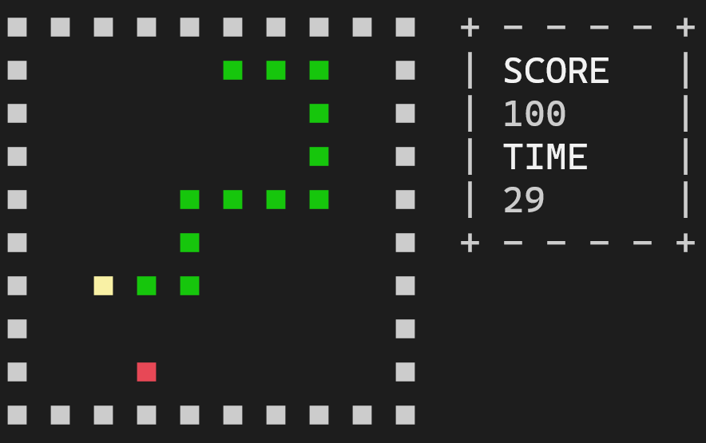

# Console-Snake
 A simple snake game played in the (windows) console


### Content
* [info](#info)
* [Languages](#languages)
* [Setup](#setup)
* [Screenshots](#screenshots)

## Info
This is a simple snake game that can be played using the windows console or the windows terminal. At this time, I don't think it will work using another operating system.

## Languages
This game was entirely written in C.

## Setup
To run the game, compile it and run the output;

```
> gcc snake.c -o snake
> snake.exe
```
## Screenshots
